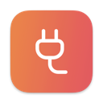
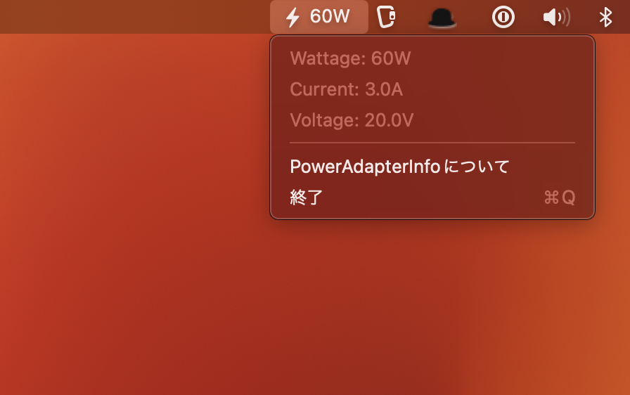

# PowerAdapterInfo

[license]: https://img.shields.io/github/license/kironono/PowerAdapterInfo?style=for-the-badge&logo=opensourcehardware&logoColor=C0CAF5&label=License

[![license]](https://github.com/kironono/PowerAdapterInfo/blob/main/LICENSE)

> AC adapter status monitoring tool for macOS.

---

## Screenshot

## License

`PowerAdapterInfo` is distributed under the terms of the MIT license.

See the [LICENSE](LICENSE) files in this repository for more information.
